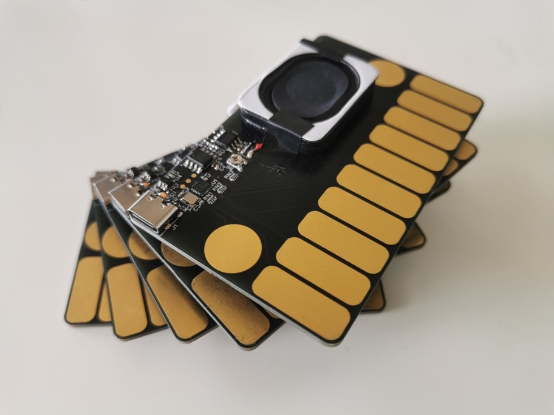

# Canta-Cart

Canta-Cart is a touch-operated musical instrument/synthesiser that takes the dimensions of a standard ID-1 card (85.6 × 53.98 mm). A portable little tune-maker in the pocket, it is easy for anyone to get hands on, yet versatile enough for the more aspiring of minds. It is plug-and-play — a USB-C power supply will take its sounds anywhere.

Additionally, the total BOM cost of CN¥5 / US$0.7 makes it an ideal greeting giveaway.

🎥 Videos:
- ["Merry Go Round of Life"](https://vimeo.com/989413177)
- ["A Short Hike"](https://vimeo.com/980840986)
- ["Pigeons and a Boy"](https://vimeo.com/970898009)

🕹️ [**Try in the browser**](https://ayuusweetfish.github.io/Canta-Cart/synth/)  
🌟 [Personal wiki page](https://ayu.land/canta-cart)
⚙️ [Hackaday project page](https://hackaday.io/project/196643-canta-cart)

## Directory Structure
- `hw/`: Circuit board design in KiCad
- `fw/`: Firmware
  - To build this, you would need a copy of the following files:
    - `debug/Puya.PY32F0xx_DFP.1.1.7.pack`: CMSIS pack to support flashing and debugging. Download from [Arm Keil’s website](https://www.keil.arm.com/packs/py32f0xx_dfp-puya/versions/). (SHA-1: `d3d40536eb2b465c1fbe483f0e1d66b776cbcbb6`)
      - This can also be installed through PyOCD’s pack management system.
    - `PY32F0xx_Firmware_V1.4.1/`: Firmware library. Download from [Puya’s website](https://www.puyasemi.com/en/gongjuyuruanjian.html). (Zip SHA-1: `c5146b8456401b8718d24bd71ab4e5568bd2c0f8`)
  - And the following software (versions for reference):
    - GNU Make (3.81)
    - Arm GNU Toolchain (GCC 10.3.1)
    - PyOCD (0.36.0)
  - Run `make` to build; `make flash` to upload. Add `OPT=-O3` for an optimised build (released version).
- `misc/synth/`: The synthesiser application (emulator) and its WebGL port, both implemented with [Sokol](https://github.com/floooh/sokol)
  - `canta_synth.h`: The actual synthesiser implementation, which is also included from the firmware
- `releases/`: Gerber files submitted to fabrication houses and firmware binaries at pinned revisions

## Licence
All content in this repository is distributed under CERN-OHL-S (CERN Open Hardware Licence Version 2, Strongly Reciprocal). See full text at `COPYING.txt` or [website](https://ohwr.org/cern_ohl_s_v2.txt).
